# CLI Architecture

This document describes the Happier CLI (`apps/cli`) and its daemon. The CLI is both an interactive tool and a background session manager that keeps machine state in sync with the server.

Environment-specific rollout, acceptance, and recovery records are intentionally
outside this public architecture page. See
[Repository boundary for custom deployments](repository-boundary.md).

## System overview

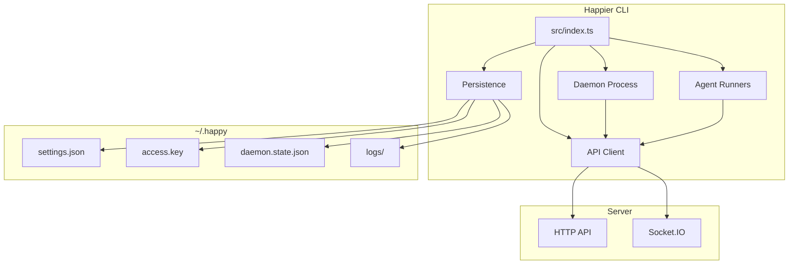

## High-level layout
- **Entry point:** `src/index.ts` parses subcommands and routes execution.
- **API client:** `src/api` handles HTTP + Socket.IO, encryption, and RPC.
- **Daemon:** `src/daemon` runs in the background, spawns sessions, and maintains machine state.
- **Persistence/config:** `src/persistence.ts` + `src/configuration.ts` manage local state in `~/.happy`.
- **Agents:** `src/claude`, `src/codex`, `src/gemini` provide provider-specific runners.

## CLI entry flow

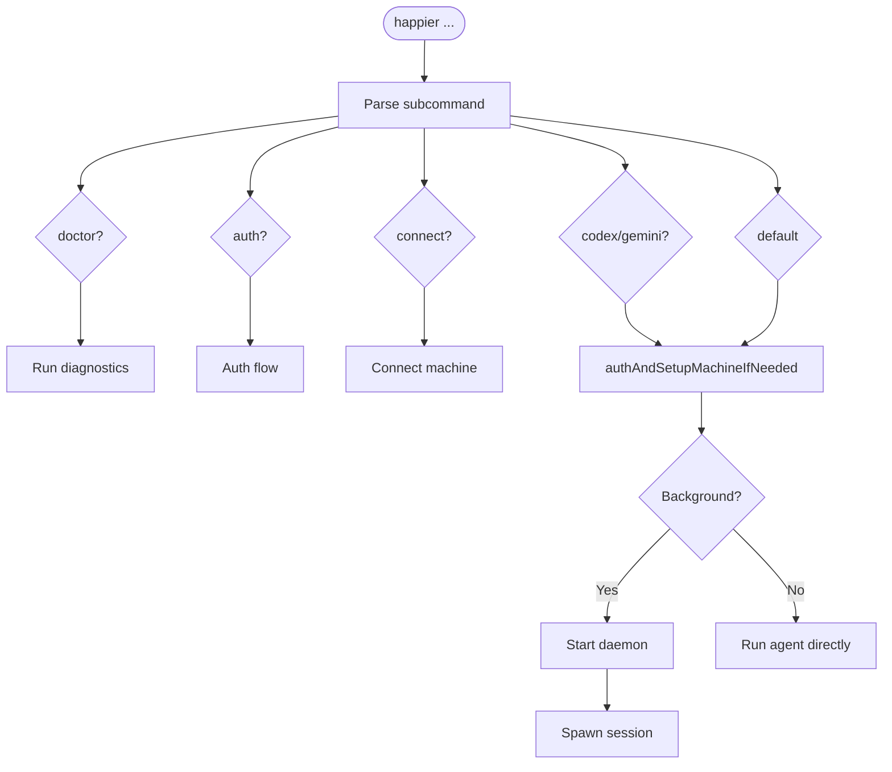

`src/index.ts` is the CLI router. It:
- Parses subcommands (`doctor`, `auth`, `connect`, `codex`, `gemini`, and default run flows).
- Ensures auth and machine setup when needed (`authAndSetupMachineIfNeeded`).
- Starts the daemon or runs an agent directly based on subcommand/context.

## Local state and configuration

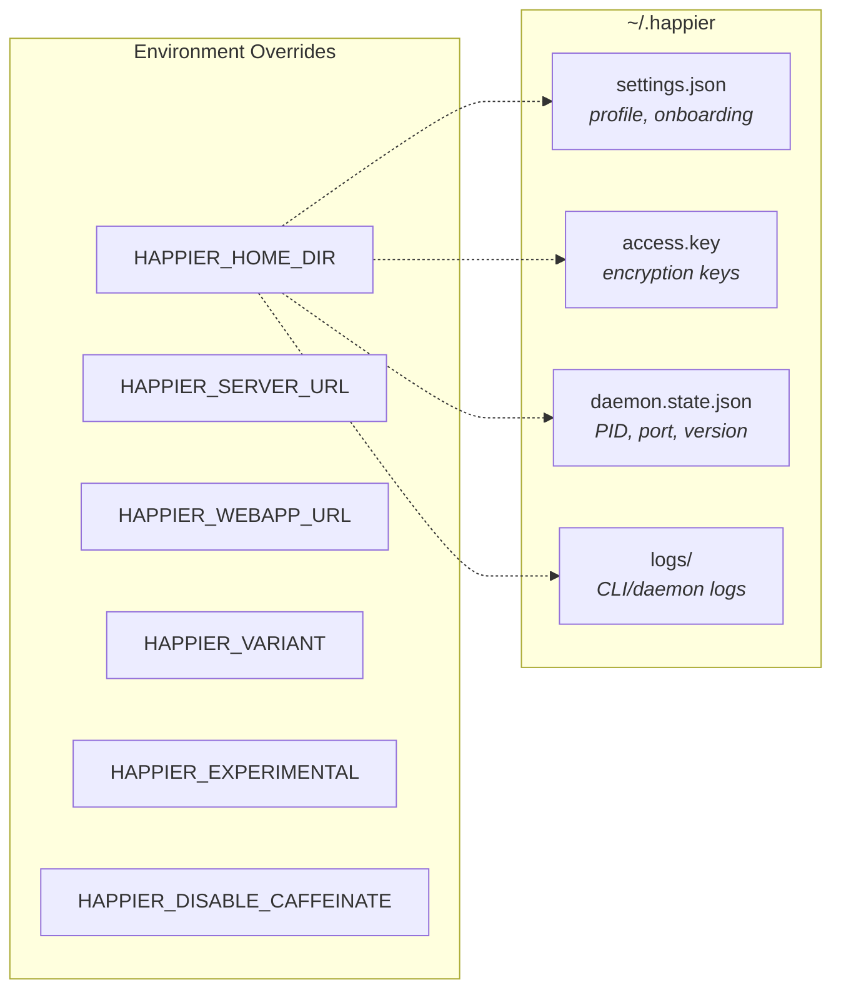

Local state lives under `~/.happier` (or `HAPPIER_HOME_DIR`):
- `settings.json`: onboarding and profile settings (validated/migrated).
- `access.key`: local key material for encryption/auth.
- `daemon.state.json`: daemon PID + control port + version.
- `logs/`: CLI/daemon logs.

Configuration lives in `src/configuration.ts`:
- `HAPPIER_SERVER_URL` and `HAPPIER_WEBAPP_URL` override defaults.
- `HAPPIER_VARIANT`, `HAPPIER_EXPERIMENTAL`, `HAPPIER_DISABLE_CAFFEINATE` control behavior.

## API client architecture

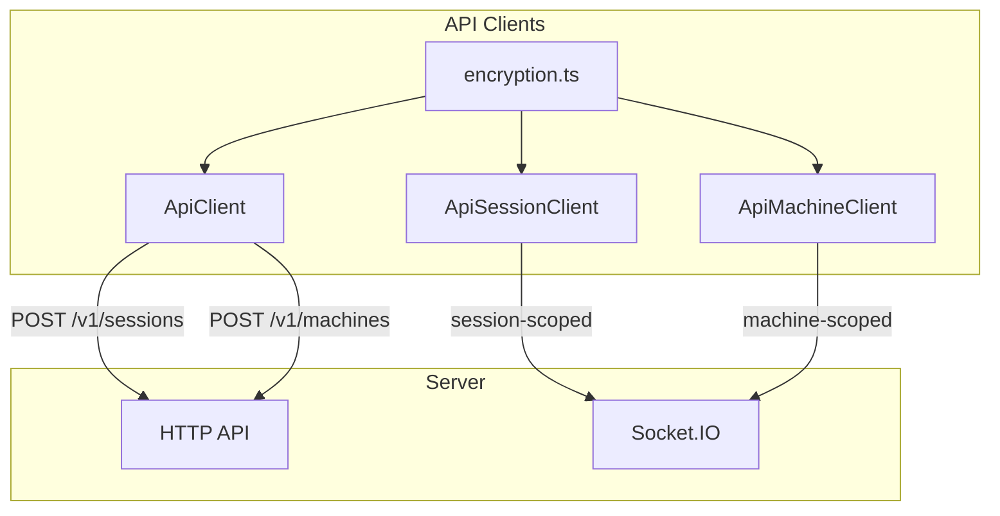

### HTTP
`ApiClient` (`src/api/api.ts`) handles:
- Session creation (`POST /v1/sessions`) with encrypted metadata/state.
- Machine registration (`POST /v1/machines`) with encrypted metadata/daemon state.
- Other CRUD actions through `ApiSessionClient` and `ApiMachineClient`.

### WebSocket

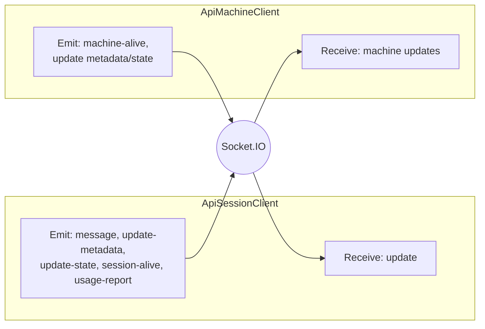

`ApiSessionClient` (`src/api/apiSession.ts`) connects to Socket.IO as a **session-scoped** client:
- Receives `update` events and decrypts message content.
- Emits `message`, `update-metadata`, `update-state`, `session-alive`, and `usage-report`.

`ApiMachineClient` (`src/api/apiMachine.ts`) connects as a **machine-scoped** client:
- Sends `machine-alive` heartbeats.
- Updates machine metadata/daemon state with optimistic concurrency.
- Receives machine updates and merges them locally.

### Encryption

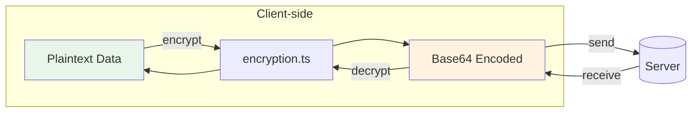

The CLI encrypts client content before it leaves the machine using `src/api/encryption.ts`.
- Session metadata, agent state, messages, machine state, artifacts, and KV values are encrypted client-side.
- On-wire encoding is base64; see `encryption.md`.

## Daemon architecture

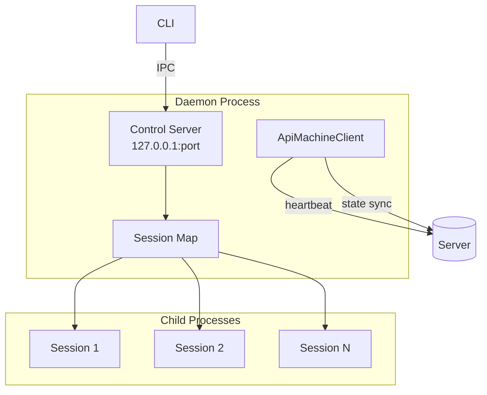

The daemon is a long-lived process responsible for running sessions in the background and maintaining machine presence.

### Lifecycle

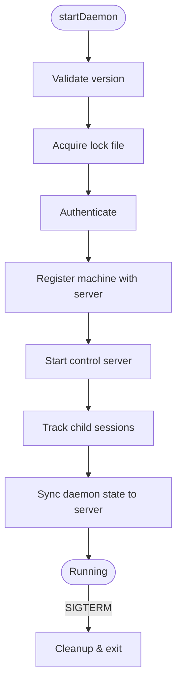

1. `startDaemon()` validates the running version and acquires a lock file.
2. It authenticates and registers the machine with the server.
3. It starts a local **control server** for IPC.
4. It keeps a map of tracked child sessions and updates daemon state on the server.

In current development, `createOnChildExited` releases session-marker evidence only
through the tracked exit lifecycle. An exit notification for an untracked PID does
not authorize marker deletion. Failed terminal-exit staging retains tracking and
marker evidence; visible-console startup awaits that cleanup and reports an
incomplete retirement rather than allowing its rejection to escape.

### Model-capacity recovery (development)

`TemporaryThrottleRecoveryScheduler` owns scheduling after a terminal capacity failure.
The Codex adapter reports that terminal failure to host recovery without an extra
immediate retry; native Codex retry-in-progress notifications remain nonterminal.
Consecutive capacity failures wait 5, 10, 20, 40, 80, 160, then 300 seconds before
jitter of ±20%. Provider retry/reset timing is a minimum, not a replacement for
the backoff. The delay is capped, not the number of attempts.

The capacity streak survives continuation handoff. Pending acceptance, a new turn
id, or reconnection is not evidence of model recovery. Only an accepted completed
turn resets the streak. A handed-off continuation has no second retry timer while
its outcome is pending; user cancellation remains authoritative. Authentication,
quota, and non-capacity transport recovery retain their own classifications and
policies.

### Control server (local IPC)

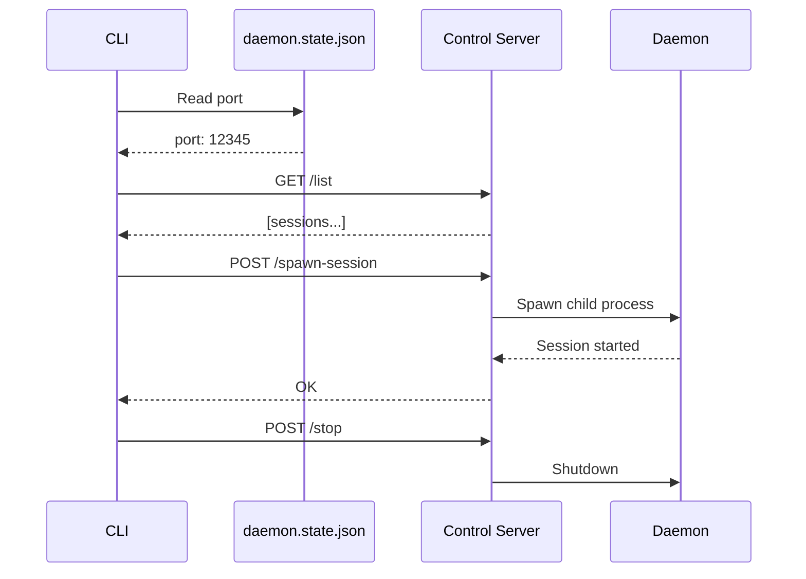

`startDaemonControlServer()` (`src/daemon/controlServer.ts`) runs an HTTP server on `127.0.0.1` and exposes:
- `/list` (list active sessions)
- `/stop-session`
- `/spawn-session`
- `/stop` (shutdown daemon)
- `/session-started` (session self-report)

The CLI talks to this server via `controlClient.ts`, using a port stored in `daemon.state.json`.

### Session spawning

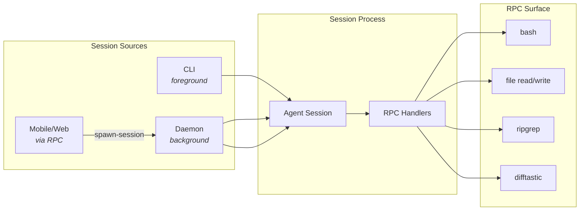

Sessions can be started by:
- The CLI directly (foreground).
- The daemon (background).
- Remote requests over RPC (from mobile/web via machine connection).

Daemon session spawning uses `registerCommonHandlers` to expose a controlled RPC surface (shell commands, file operations, search/diff helpers).

### Accepted spawn identity settlement

The customization fork includes a compatibility adapter for callers that omit a
usable spawn nonce. See the [maintained customization contract](cuihui-customizations.md#daemon-spawn-identity-settlement)
and [mixed-client limits](compatibility.md#daemon-spawn-identity-settlement).

The machine RPC adapter in `apps/cli/src/api/machine/rpcHandlers.ts` calls
`handleTrackedSpawnHappySession` once per handler invocation. For
`SPAWN_HAPPY_SESSION_PROVIDER_SAFE`, a caller-supplied `spawnNonce` that is a
string with nonblank trimmed content retains the existing response, including
modern accepted-but-pending success. The opaque identifier helper validates
presence without rewriting its bytes.

When that caller nonce is absent, non-string, empty, or whitespace-only, the
provider-safe route uses `settleAcceptedSpawnIdentity`, also used by the
legacy `SPAWN_HAPPY_SESSION` RPC. Existing errors, directory-approval responses,
and successes already carrying `sessionId` pass through. For a pending success,
the adapter delegates to `awaitSpawnedSessionId` in
`apps/cli/src/session/services/awaitSpawnedSessionId.ts`. Resolution uses only
the nonce on that accepted spawn's result, including a daemon-generated nonce.
It does not guess from the newest session, directory, timestamp, or current
child, and settlement does not spawn a second session.

On settlement success the response is `{ type: 'success', sessionId }`,
preserving `pendingFirstInputAccepted` if it was a boolean, including `false`.
This preserves the custody signal; it does not assert that the first input was
executed. Existing daemon admission/coalescing and retry behavior is unchanged:
per-result identity correlation is not a guarantee that identical requests
create distinct sessions or that nonce-less requests have caller-key idempotency.

The existing helper defaults to a 90-second settlement budget and 250 ms polling.
`HAPPIER_SPAWN_SESSION_ID_RESOLVE_TIMEOUT_MS` and
`HAPPIER_SPAWN_SESSION_ID_RESOLVE_POLL_INTERVAL_MS` retain their existing bounds
(100 ms to 10 minutes and 25 ms to 10 seconds, respectively); this experiment
does not change those settings. Failure to resolve is not fabricated success:
timeout returns `SESSION_WEBHOOK_TIMEOUT`, while missing resolution capability,
untracked identity, and resolver errors retain the helper's explicit errors.
The inspected old client still polls its own never-submitted nonce on that
timeout, so the adapter does not solve every delayed-start case.

Regression cases in `apps/cli/src/api/machine/rpcHandlers.test.ts` cover
generated-nonce direct identity with first-input acknowledgement, malformed or
blank nonce handling, out-of-order settlement, bounded timeout, and an
already-direct ID. These tests do not establish live client acceptance.

### Machine state

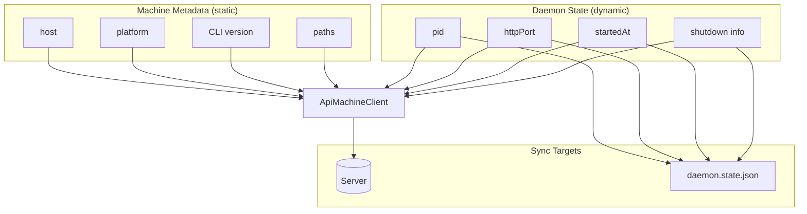

- **Machine metadata** is static info (host, platform, CLI version, paths).
- **Daemon state** is dynamic (pid, httpPort, startedAt, shutdown info).

The daemon updates these via `ApiMachineClient` and mirrors local state into `daemon.state.json` for control/diagnostics.

## RPC and tool bridge

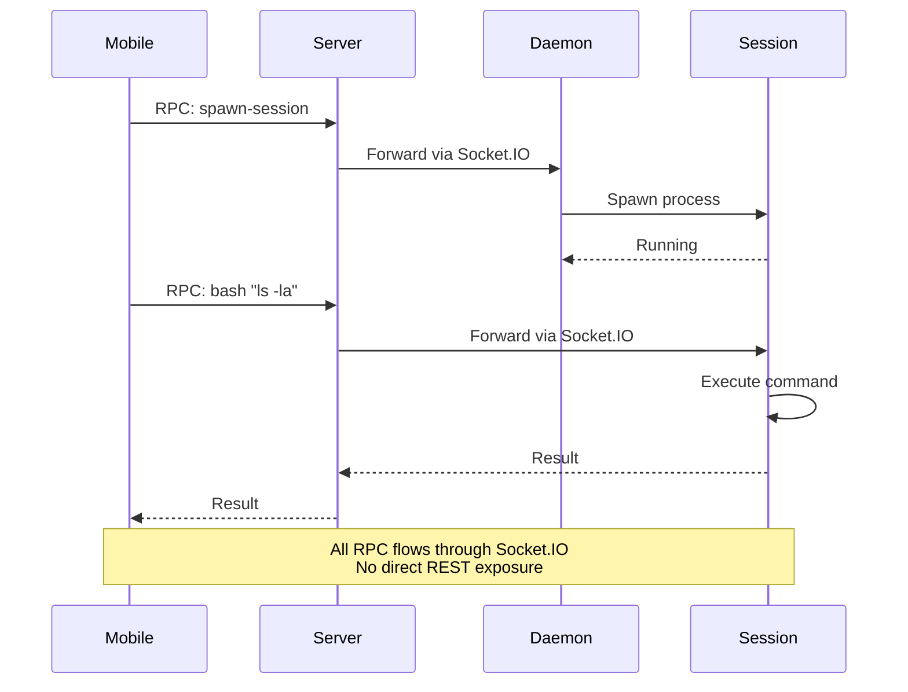

RPC is used to send commands over the Socket.IO connection:
- Sessions register RPC handlers (e.g., `bash`, file read/write, `ripgrep`, `difftastic`).
- The daemon registers a spawn-session handler so the server/mobile client can ask it to start a local session.

This mechanism allows the server and mobile clients to drive local actions without exposing a broad REST surface.

## Implementation references
- CLI entry: `apps/cli/src/index.ts`
- Daemon: `apps/cli/src/daemon`
- Control server/client: `apps/cli/src/daemon/controlServer.ts`, `apps/cli/src/daemon/controlClient.ts`
- API clients: `apps/cli/src/api`
- Persistence: `apps/cli/src/persistence.ts`
- Config: `apps/cli/src/configuration.ts`
